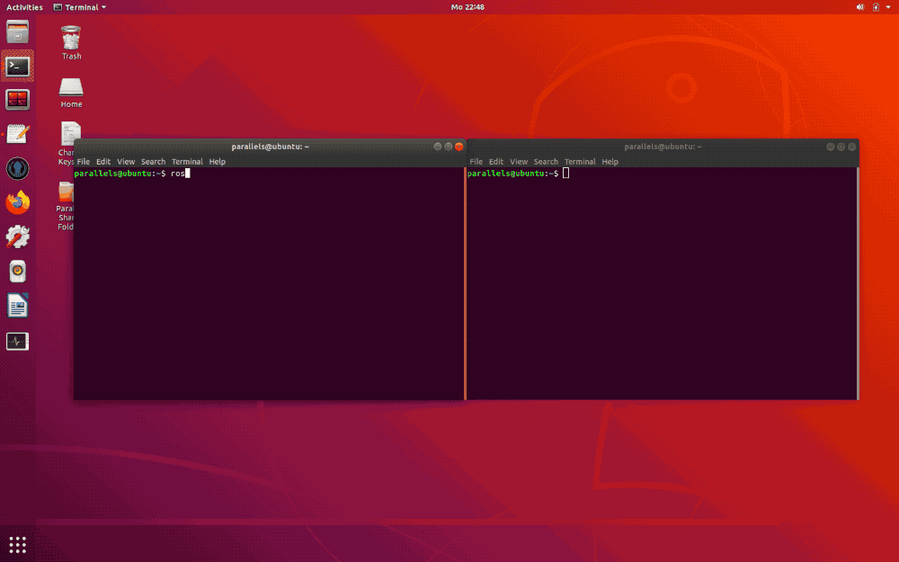

# 3D Radiation Mapper with Voxblox (Online Mapper)
This branch is used to map radiation intensities into a 3D environment representation. Therefore a RNM (radiation nuclear mapper) node was built into Voxblox ([original repository](https://github.com/ethz-asl/voxblox)). It is used e.g. for [EnRicH](https://enrich.european-robotics.eu).

This method is called **online mapping** here, because the mapping can be done while a rescue robot is in operation or after the operation by replaying ROS bag files, which were used to record the operation before.

## Table of Content

1. [Requirements](#1-requirements)
2. [How to Run 3D Radiation Mapper?](#2-how-to-run-3d-radiation-mapper)
3. [How to Export 3D Radiation Mesh?](#3-how-to-export-3d-radiation-mesh)
4. [Further Information](#4-further-information)

## 1. Requirements
Before you start, make sure that you have selected the right branches.

| Repository | Branch |
|:-:|:-:|
| **voxblox** (this repository) | [radio_nuclear_mapper](https://git.sim.informatik.tu-darmstadt.de/hector/hector_voxblox/-/tree/radio_nuclear_mapper) (this branch) |
| **radiological_nuclear_mapper** | [voxblox](https://git.sim.informatik.tu-darmstadt.de/hector/hector_enrich/-/tree/voxblox/radiological_nuclear_mapper) |
| **hector_vehicle_launch** | [radiological_nuclear_mapper](https://github.com/tu-darmstadt-ros-pkg/hector_vehicle_launch/tree/radiological_nuclear_mapper) |

## 2. How to Run 3D Radiation Mapper?
**TL;DR:** [Use this](#prepare)

Decide for one EnRicH run or create new file(s) for a new run. Make sure you have the corresponding bag files. If you have all required files collected continue with the instructions for manual or automated start.

### Launch Files

#### Choose the Launch File for Voxblox
The launch files for Voxblox are located in branch *radio_nuclear_mapper* of repository *hector_vehicle_launch*:

- [`hector_sensor_proc_launch/launch/voxblox_rnm_enrich_2017.launch`](https://github.com/tu-darmstadt-ros-pkg/hector_vehicle_launch/blob/radiological_nuclear_mapper/hector_sensor_proc_launch/launch/voxblox_rnm_enrich_2017.launch) (for bag files of EnRicH 2017)
- [`hector_sensor_proc_launch/launch/voxblox_rnm_enrich_2019_1.launch`](https://github.com/tu-darmstadt-ros-pkg/hector_vehicle_launch/blob/radiological_nuclear_mapper/hector_sensor_proc_launch/launch/voxblox_rnm_enrich_2019_1.launch) (for bag files of EnRicH 2019 Run 1)*
- [`hector_sensor_proc_launch/launch/voxblox_rnm_enrich_2019_2.launch`](https://github.com/tu-darmstadt-ros-pkg/hector_vehicle_launch/blob/radiological_nuclear_mapper/hector_sensor_proc_launch/launch/voxblox_rnm_enrich_2019_2.launch) (for bag files of EnRicH 2019 Run 2)

\* The mesh shown above was created with this data.

[Here](https://github.com/tu-darmstadt-ros-pkg/hector_vehicle_launch/blob/radiological_nuclear_mapper/hector_sensor_proc_launch/launch/README.md#voxblox_rnm_launch) is a description of the parameters in launch files. 

#### Choose the Launch File for Static TF Publisher
This step is **only** required if only a single message via the ros topic `/tf_static` in the bag files is published once at the beginning. In this case skipping the first time of a recording will effect, that static transformations are unknown. For EnRicH 2017 thats the case. Therefore do following:

1. [Generate a Static Transformation Publisher](https://git.sim.informatik.tu-darmstadt.de/hector/hector_enrich/-/tree/voxblox/generate_static_transformation_publisher) or choose [static_tf_2017.launch](https://git.sim.informatik.tu-darmstadt.de/hector/hector_enrich/-/blob/voxblox/generate_static_transformation_publisher/static_tf_2017.launch)
2. Copy the launch file to directory `~/hector/src/robot_launch/robot_postproc_launch/launch`

#### Is there a LIDAR pointcloud self filter?
- EnRicH 2017: No
- EnRicH 2019: Yes ([vlp16_self_filter.launch](https://git.sim.informatik.tu-darmstadt.de/drz/drz_telemax_launch/-/blob/master/drz_telemax_onboard_launch/launch/lidar_proc/vlp16_self_filter.launch))

Keep the launch file in mind for later.

#### Pro Tip: Use predefined RVIZ configurations
Also in branch *radio_nuclear_mapper* of repository *hector_vehicle_launch* are a few prepared .rviz files these describe the configuration of [RVIZ](http://wiki.ros.org/rviz) windows:

- [`hector_sensor_proc_launch/enrich2017_mesh.rviz`](https://github.com/tu-darmstadt-ros-pkg/hector_vehicle_launch/blob/radiological_nuclear_mapper/hector_sensor_proc_launch/enrich2017_mesh.rviz) (for EnRicH 2017 run)
- [`hector_sensor_proc_launch/enrich2019_mesh.rviz`](https://github.com/tu-darmstadt-ros-pkg/hector_vehicle_launch/blob/radiological_nuclear_mapper/hector_sensor_proc_launch/enrich2019_mesh.rviz) (for both EnRicH 2019 runs)

### Start Manually

Ensure `roscore` is running. Then you need six additional terminal windows. Execute these commands one after the other in each window: 

1. `roslaunch robot_postproc_launch play_with_recorded_tf.launc`
2. (Only if a static tf publisher is required)`roslaunch robot_postproc_launch static_tf_XXXX.launch`
3. (Only if a pointcloud filter exists) `roslaunch drz_telemax_onboard_launch vlp16_self_filter.launch`
4. `roslaunch hector_sensor_proc_launch voxblox_rnm_enrich_XXXX.launch`
5. `rviz -d ~/hector/src/hector_vehicle_launch/hector_sensor_proc_launch/enrichXXXX_mesh.rviz`
6. `rosparam set use_sim_time true && cd /path/to/bags && rosbag play *.bag --clock -r 1 -s 220 /spin_laser/vlp16:=/spin_laser/vlp16_trash` *

\* Adjust the path to the folder where the bag files are stored in.

#### Examples
Ensure `roscore` is running.

| Step | EnRicH 2019 Run 1 | EnRicH 2019 Run 2 | EnRicH 2017 |
|:-:|:-:|:-:|:-:|
| 1 | `roslaunch robot_postproc_launch play_with_recorded_tf.launc` | `roslaunch robot_postproc_launch play_with_recorded_tf.launc` | `roslaunch robot_postproc_launch play_with_recorded_tf.launc` |
| 2 |  |  | `roslaunch robot_postproc_launch static_tf_2017.launch` |
| 3 | `roslaunch drz_telemax_onboard_launch vlp16_self_filter.launch` | `roslaunch drz_telemax_onboard_launch vlp16_self_filter.launch` |  |
| 4 | `roslaunch hector_sensor_proc_launch voxblox_rnm_enrich_2019_1.launch` | `roslaunch hector_sensor_proc_launch voxblox_rnm_enrich_2019_2.launch` | `roslaunch hector_sensor_proc_launch voxblox_rnm_enrich_2017.launch` |
| 5 | `rviz -d ~/hector/src/hector_vehicle_launch/hector_sensor_proc_launch/enrich2019_mesh.rviz` | `rviz -d ~/hector/src/hector_vehicle_launch/hector_sensor_proc_launch/enrich2019_mesh.rviz` | `rviz -d ~/hector/src/hector_vehicle_launch/hector_sensor_proc_launch/enrich2017_mesh.rviz` |
| 6* | `rosparam set use_sim_time true && cd /media/psf/Home/enrich/2019/competition_run_1/bags && rosbag play *.bag --clock -r 1 -s 220 /spin_laser/vlp16:=/spin_laser/vlp16_trash` | `rosparam set use_sim_time true && cd /media/psf/Home/enrich/2019/competition_run_1/bags && rosbag play *.bag --clock -r 1 -s 220 /spin_laser/vlp16:=/spin_laser/vlp16_trash` | `rosparam set use_sim_time true && cd /media/psf/Home/enrich/2017/final2/bags && rosbag play *.bag --clock -s 780 /spin_laser/vlp16:=/spin_laser/vlp16_trash` |

\* Adjust the path to the folder where the bag files are stored in.

### ALTERNATIVE: Use the Super Cool All In One Terminator Start Script
That the execution of six commands in six terminals is very time-consuming and gets annoying very fast, if you have to do it often, there is a start script for the terminal emulator [Terminator](https://en.wikipedia.org/wiki/GNOME_Terminator), which starts all commands at once.

The command `roscore` is not included here, because `roscore` must be started before the other commands run and that takes some time. But this is not a problem, because you can let `roscore` run all the time while you start and stop Terminator for testing or optimizing the parameters.

#### Prepare

First you have to replace the content of Terminator's config file `~/.config/terminator/config` with the content of the prepared config file [`hector_sensor_proc_launch/enrich_terminator.config`](https://github.com/tu-darmstadt-ros-pkg/hector_vehicle_launch/blob/radiological_nuclear_mapper/hector_sensor_proc_launch/enrich_terminator.config) from the repository *hector_vehicle_launch* (branch *radio_nuclear_mapper*).

#### Go!
Ensure `roscore` is running. Open additional terminal and run one of the following commands:
- `terminator -l enrich2017`
- `terminator -l enrich2019_1`
- `terminator -l enrich2019_2`

#### Stop the Skript

The easiest way to stop all parallel running commands is to close the new Terminator window via the close button in the upper right.

## 3. How to Export 3D Radiation Mesh?

The 3D radiation mapper has a built-in export function for the created mesh. Depending on the size of the 3D map it could be CPU-intensive and takes some time. It is advisable to check if ros bags are no longer playing. If they have not finished playing, it is best to pause them. Put the focus in the terminal that plays the bag files and press the spacebar.

To export the mesh in the intensity display as it was set in the launch file and displayed in RVIZ, you can use this command in an additional terminal (i.e. also in a unused Terminator child):

`rostopic pub /radio_nuclear_mapper_server/save_mesh std_msgs/String "'original'"` (Pay attention to the double single quotes combination!)

Also all combinations of the intensity representation can be exported with one single command. Six meshes are then saved with the three different distance functions as well as with logarithmic and linear intensity representation. The colormap will be the trafic light colormap. To do this, execute this command:

`rostopic pub /radio_nuclear_mapper_server/save_mesh std_msgs/String "'all'"`

Instead of `"'original'"` or `"'all'"` you can use `"'decreasing'"`, `"'increasing'"` or `"'constant'"` to export one mesh with the corresponding radiation distance function. The colormap will be the trafic light colormap. The setting whether the logarithm should be used to visualize the intensity or not is taken from the voxblox launch file.

After executing one of the lines above a single message will published to the Voxblox node and its start the export. Press `CMD` + `C` to stop the publishing task. (This will not stop the exporting.) In the terminal that runs the voxblox node you can see the progress of exporting.

The exported meshes can then be found as .ply files at `~/.ros`.

When exporting the meshes, to define the color gradient, the minimum and maximum are redefined according to the extreme values in the generated mesh. These values may differ from the values set in the launch file. This ensures that the whole range of the color map is used.

## 4. Further Information
To get a better understanding of the project, you can also read the description of the parameters in the launch files for Voxblox [here](https://github.com/tu-darmstadt-ros-pkg/hector_vehicle_launch/blob/radiological_nuclear_mapper/hector_sensor_proc_launch/launch/README.md#voxblox_rnm_launch).

Within the scope of this project work further software projects have been developed. These are collected in the repository [3D Radiation Mapper Tools](https://git.sim.informatik.tu-darmstadt.de/hector/3d_radiation_mapper_tools).
